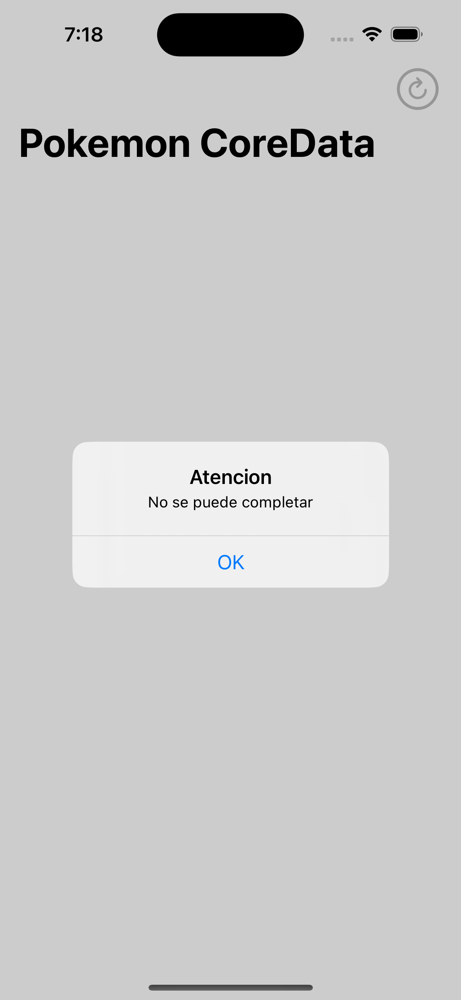

# PokedexApp

Prueba tecnica para Banco Atlantida

## Screenshots

 MainView

 DetailView

 ErrorMessage

 Notification

 Notification

## Authors

- [@lopez0412](https://www.github.com/lopez0412)

## Tech Stack

**App:** Swift, SwiftUI

